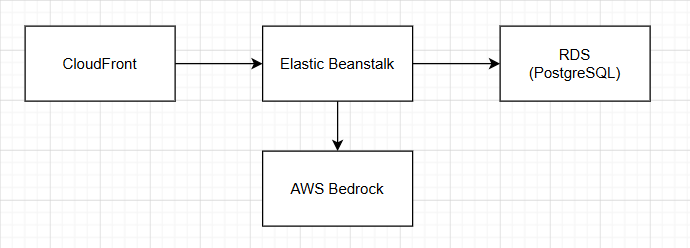

# Deployment documentation
This document provides instructions for deploying the application in an elastic beanstalk environment and how we setup our pipeline to have this work.
## CI/CD Pipeline
### Build Job
- Runs on: push & pull requests to the main branch and development branch
- Steps:
  - Checkout code
  - Set up JDK 25 (Temurin)
  - Configure Gradle with caching
  - Make Gradle wrapper executable
  - Run Checkstyle checks (checkstyleMain checkstyleTest)
  - Run tests with coverage (build jacocoTestReport testCodeCoverageReport), skipping Checkstyle to avoid duplicate checks
  - Upload JaCoCo XML report as an artifact (for later use or display)
  - Run SonarQube analysis using SONAR_TOKEN secret

### Docker GitHub (GHCR) Job
- Runs on: push events (not pull)
- Purpose: Build and push a Docker image to GitHub Container Registry under the repository’s namespace. This makes it easier to test the image in a staging environment before deploying to production.
- Steps:
  - Login to ghcr.io using the GitHub actor and GITHUB_TOKEN
  - Set up Docker Buildx
  - Extract metadata to tag images with branch name and latest (only for main branch)
  - Build and push the image
This image is tagged as: `ghcr.io/cookbook-stage2026/cookbook-backend:<branch>`
`ghcr.io/cookbook-stage2026/cookbook-backend:latest   (only for main)`
  
### Docker AWS Job
- Runs on: push events (intended for development)
- Purpose: Build, push to Amazon ECR, and deploy to Elastic Beanstalk
- Steps:
  - Configure AWS credentials using repository secrets:
    - AWS_ACCESS_KEY_ID
    - AWS_SECRET_ACCESS_KEY
    - AWS_REGION
  - Log in to Amazon ECR
  - Build and push the Docker image to ECR with the tag: `${{ secrets.AWS_ACCOUNT_ID }}.dkr.ecr.${{ secrets.AWS_REGION }}.amazonaws.com/cookbook/backend:latest`
  - Deploy to Elastic Beanstalk using the AWS CLI with the following command:
    - Zip the contents of deploy-files/
    - Upload the zip to an S3 bucket elasticbeanstalk-<region>-<account-id>/deploy-files/
    - Create a new application version with label ${{ github.run_id }}
    - Update the Elastic Beanstalk environment (CookBook-env) with the new version
    - Wait until the environment update completes

## Configuration Management
the application uses Spring Boot’s externalized configuration. The application.properties file in the repository contains default values suitable for local development and testing, but sensitive or environment-specific settings are overridden at runtime using environment variables in the deployment environment (Elastic Beanstalk, GitHub Actions, etc.).

### Environment-Specific Overrides
For local development, a developer can set the run profile to "dev" and point to a local Ollama instance using their own application-local.properties or environment variables.
In production (AWS Elastic Beanstalk), the application uses the following configuration, which is bundled in the deploy-files/ directory as part of the deployment package:
You can view the properties for deployment here: [application-deploy.properties](../application/src/main/resources/application-deploy.properties)
For local development, you have to create a file with the name `application-dev.properties` in the same directory as `application-deploy.properties` and add the following content:
```spring.datasource.driver-class-name=org.sqlite.JDBC
spring.datasource.driver-class-name=org.sqlite.JDBC
spring.datasource.url=jdbc:sqlite:myDatabase.db
spring.datasource.username=Developer
spring.datasource.password=Developer

spring.jpa.database-platform=org.hibernate.community.dialect.SQLiteDialect
spring.jpa.hibernate.ddl-auto=create-drop
spring.jpa.defer-datasource-initialization=true
spring.sql.init.mode=always
app.cors.allowed-headers=*
spring.security.oauth2.client.registration.google.redirect-uri={baseUrl}/login/oauth2/code/{registrationId}
spring.security.oauth2.client.registration.github.redirect-uri={baseUrl}/login/oauth2/code/{registrationId}
spring.security.oauth2.client.registration.microsoft.redirect-uri={baseUrl}/login/oauth2/code/{registrationId}

bedrock.region=eu-north-1
bedrock.model-id=eu.anthropic.claude-haiku-4-5-20251001-v1:0

ollama.model-name=finetuned_llama
ollama.base-url=http://localhost:11434/

ollama.max-response-time-in-minutes=15

firecrawl.mcp-url=http://localhost:3001/mcp

firecrawl.enabled=true
```
This configuration allows developers to run the application locally with a SQLite database and use Ollama as the AI provider, while the production environment can use a different database and AI provider without changing the codebase.
You can also add bedrock properties but for that you need an AWS account with access to Bedrock and the necessary credentials.
This application also uses Firecrawl for web crawling, and the configuration for that is included in the properties file as well. Just like with running the ollama AI instance, you can also run a local instance of Firecrawl for development and testing purposes. The `firecrawl.enabled` property can be set to `true` to enable the integration, and the `firecrawl.mcp-url` property should point to the local instance of Firecrawl. Both of these things are started in this docker compose file: [docker-compose.yml](../docker-compose.yml).
There is also a `secret.properties` file in the directory with the other files. Here, you have to configure the secrets for the application. This file is not included in the repository for security reasons, but you can create it locally with the following content:
``` 
spring.security.oauth2.client.registration.google.client-id=YourGoogleClientId
spring.security.oauth2.client.registration.google.client-secret=YourGoogleClientSecret
spring.security.oauth2.client.registration.github.client-id=YourGithubClientId
spring.security.oauth2.client.registration.github.client-secret=YourGithubClientSecret
spring.security.oauth2.client.registration.microsoft.client-id=YourMicrosoftClientId
spring.security.oauth2.client.registration.microsoft.client-secret=YourMicrosoftClientSecret
app.jwt.secret=YourJWTSecretKey
app.cors.allowed-origins=your-allowed-origin
firecrawl.api-key=YourFirecrawlApiKey
```
For more information on security you can refer to the [security documentation](./security-documentation.md).
Here you can also set the credentials for Bedrock if you have access to it, but make sure to keep this file secure and do not commit it to version control.
```
bedrock.aws-access-key-id=YourAWSAccessKeyId
bedrock.aws-secret-access-key=YourAWSSecretAccessKey
bedrock.region=YourAWSRegion
bedrock.model-id=YourBedrockModelId
```

### Aws Infrastructure Overview
The deployment spans multiple AWS services:



- **CloudFront**: Serves as the CDN for the frontend, caching static assets and improving load times globally.
- **Elastic Beanstalk**: Hosts the backend and frontend application, providing an environment for running the Spring Boot application with managed scaling and deployment.
- **RDS (Relational Database Service)**: Provides a managed relational database for the application.
- **ECR**: Stores Docker images for the backend and frontend application, which are built and pushed from the CI/CD pipeline.
- **Bedrock**: Used as the AI provider for the application.

#### Elastic Beanstalk Environment Variables
The following environment variables are configured in the Elastic Beanstalk environment:
- `RDS_HOSTNAME`: The hostname of the RDS database instance.
- `RDS_PORT`: The port number for the RDS database instance.
- `RDS_DB_NAME`: The name of the RDS database.
- `RDS_USERNAME`: The username for the RDS database.
- `RDS_PASSWORD`: The password for the RDS database.
- `BEDROCK_AWS_ACCESS_KEY_ID`: AWS Access Key ID for Bedrock.
- `BEDROCK_AWS_SECRET_ACCESS_KEY`: AWS Secret Access Key for Bedrock.
- `GOOGLE_CLIENT_ID`: OAuth2 client ID for Google authentication.
- `GOOGLE_CLIENT_SECRET`: OAuth2 client secret for Google authentication.
- `GITHUB_CLIENT_ID`: OAuth2 client ID for GitHub authentication.
- `GITHUB_CLIENT_SECRET`: OAuth2 client secret for GitHub authentication.
- `MICROSOFT_CLIENT_ID`: OAuth2 client ID for Microsoft authentication.
- `MICROSOFT_CLIENT_SECRET`: OAuth2 client secret for Microsoft authentication.
- `JWT_SECRET`: Secret key for signing JWT tokens.
- `CORS_ALLOWED_ORIGINS`: Allowed origins for CORS configuration.
- `BASE_URL`: Base URL for the application, used in OAuth2 redirect URIs.
- `FIRECRAWL_API_KEY`: API key for Firecrawl integration.

These are set manually in the Elastic Beanstalk console under Configuration → Software → Environment properties, except for RDS variables which are automatically provided when an RDS instance is associated with the environment.

## Required GitHub Secrets
- `SONAR_TOKEN`: Token for SonarQube analysis
- `AWS_ACCESS_KEY_ID`: AWS Access Key ID for deploying to Elastic Beanstalk
- `AWS_SECRET_ACCESS_KEY`: AWS Secret Access Key for deploying to Elastic Beanstalk
- `AWS_REGION`: AWS Region for deploying to Elastic Beanstalk
- `AWS_ACCOUNT_ID`: AWS Account ID for pushing Docker images to ECR
- `GITHUB_TOKEN`: Token for GitHub API access (automatically provided by GitHub Actions, used for GHCR authentication)